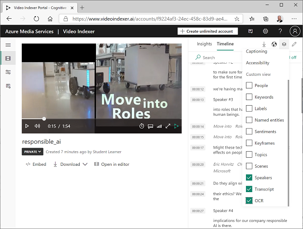
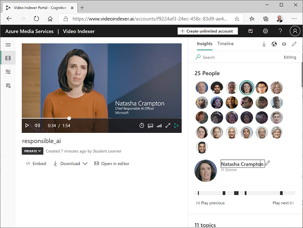

---
lab:
    title: 'Analyze Video with Video Indexer'
---

# Analyze Video with Video Indexer

A large proportion of the data created and consumed today is in the format of video. **Video Indexer** is an AI-powered service that you can use to index videos and extract insights from them.

## Clone the repository for this course

If you have not already done so, you must clone the code repository for this course:

1. Start Visual Studio Code.
2. Open the palette (SHIFT+CTRL+P) and run a **Git: Clone** command to clone the `https://github.com/MicrosoftLearning/AI-102-AIEngineer` repository to a local folder (it doesn't matter which folder).
3. When the repository has been cloned, open the folder in Visual Studio Code.
4. Wait while additional files are installed to support the C# code projects in the repo.

    > **Note**: If you are prompted to add required assets to build and debug, select **Not Now**.

## Upload a video to Video Indexer

First, you'll need to sign into the Video Indexer portal and upload a video.

1. In your browser, open the Video Indexer portal at `https://www.videoindexer.ai`.
3. If you have an existing Video Indexer account, sign in. Otherwise, sign up for a free account and sign in using your Microsoft account (or any other valid account type).
4. In Video Indexer, select the **Upload** option. Then select the option to **enter a file URL** and enter `https://aka.ms/responsible-ai-video`. Change the default name to **Responsible AI**, review the default settings, select the checkbox to verify compliance with Microsoft's policies for facial recognition, and upload the file.
3. After the file has uploaded, wait a few minutes while Video Indexer automatically indexes it.

> **Note**: In this exercise, we're using this video to explore Video Indexer functionality; but you should take the time to watch it in full when you've finished the exercise as it contains useful information and guidance for developing AI-enabled applications responsibly! 

## Review video insights

The indexing process extracts insights from the video, which you can view in the portal.

1. In the Video Indexer portal, when the video is indexed, select it to view it. You'll see the video player alongside a pane that shows insights extracted from the video.

2. As the video plays, select the **Timeline** tab to view a transcript of the video audio.

3. At the top right of the portal, select the **View** symbol (which looks similar to &#128455;), and in the list of insights, in addition to **Transcript**, select **OCR** and **Speakers**.

4. Observe that the **Timeline** pane now includes:
    - Transcript of audio narration.
    - Text visible in the video.
    - Indications of speakers who appear in the video. Some well-known people are  automatically recognized by name, others are indicated by number (for example *Speaker #1*).
5. Switch back to the **Insights** pane and view the insights show there. They include:
    - Individual people who appear in the video.
    - Topics discussed in the video.
    - Labels for objects that appear in the video.
    - Named entities, such as people and brands that appear in the video.
    - Key scenes.
6. With the **Insights** pane visible, select the **View** symbol again, and in the list of insights, add **Keywords** and **Sentiments** to the pane.

    The insights found can help you determine the main themes in the video. For example, the **topics** for this video show that it is clearly about technology, social responsibility, and ethics.

## Search for insights

You can use Video indexer to search the video for insights.

1. In the **Insights** pane, in the **Search** box, enter *Bee*. You may need to scroll down in the Insights pane to see results for all types of insight.
2. Observe that one matching *label* is found, with its location in the video indicated beneath.
3. Select the beginning of the section where the presence of a bee is indicated, and view the video at that point (you may need to pause the video and select carefully - the bee only appears briefly!)
4. Clear the **Search** box to show all insights for the video.

## Edit insights

You can use Video Indexer to edit the insights that have been found, adding custom information to make even more sense of the video.

1. Rewind the video to the start and view the **people** listed at the top of the **Insights** pane. Observe that some people have been recognized, including **Eric Horwitz**, a computer scientist and Technical Fellow at Microsoft.

2. Select the photo of Eric Horwitz, and view the information underneath - expanding the **Show biography** section to see information about this person.
3. Observe that the locations in the video where this person appears are indicated. You can use these to view those sections of the video.
4. In the video player, find the person speaking at approximately 0:34:

5. Observe that this person is not recognized, and has been assigned a generic name such as **Unknown #1**. However, the video does include a caption with this person's name, so we can enrich the insights by editing the details for this person.
6. At the top right of the portal, select the **Edit** icon (&#x1F589;). Then change the name of the unknown person to **Natasha Crampton**.

7. After you have made the name change, search the **Insights** pane for *Natasha*. The results should include one person, and indicate the sections of the video in which they appear.
8. At the top left of the portal, expand the menu (&#8801;) and select the **Model customizations** page. Then on the **People** tab, observe that the **Default** people model has one person in it. Video Indexer has added the person you named to a people model, so that they will be recognized in any future videos you index in your account.

You can add images of people to the default people model, or add new models of your own. This enables you to define collections of people with images of their face so that Video Indexer can recognize them in your videos.

Observe also that you can also create custom models for language (for example to specify industry-specific terminology you want Video Indexer to recognize) and brands (for example, company or product names).

## Use Video Indexer widgets

The Video Indexer portal is a useful interface to manage video indexing projects. However, there may be occasions when you want to make the video and its insights available to people who don't have access to your Video Indexer account. Video Indexer provides widgets that you can embed in a web page for this purpose.

1. In Visual Studio Code, in the **16-video-indexer** folder, open **analyze-video.html**. This is a basic HTML page to which you will add the Video Indexer **Player** and **Insights** widgets. Note the reference to the **vb.widgets.mediator.js** script in the header - this script enables multiple Video Indexer widgets on the page to interact with one another.
2. In the Video Indexer portal, return to the **Media files** page and open your **Responsible AI** video.
3. Under the video player, select **&lt;/&gt; Embed** to view the HTML iframe code to embed the widgets.
4. In the **Share and Embed** dialog box, select the **Player** widget, set the video size to 560 x 315,  and then copy the embed code to the clipboard.
5. In Visual Studio Code, in the **analyze-video.html** file, paste the copied code under the comment **&lt;-- Player widget goes here -- &gt;**.
6. Back in the **Share and Embed** dialog box, select the **Insights** widget and then copy the embed code to the clipboard. Then close the **Share and Embed** dialog box, switch back to Visual Studio Code, and paste the copied code under the comment **&lt;-- Insights widget goes here -- &gt;**.
7. Save the file. Then in the **Explorer** pane, right-click **analyze-video.html** and select **Reveal in File Explorer**.
8. In File Explorer, open **analyze-video.html** in your browser to see the web page.
9. Experiment with the widgets, using the **Insights** widget to search for insights and jump to them in the video.

## Use the Video Indexer REST API

Video Indexer provides a REST API that you can use to upload and manage videos in your account.

### Get your API details

To use the Video Indexer API, you need some information to authenticate requests:

1. In the Video Indexer portal, expand the menu (≡) and select the **Account settings** page.
2. Note the **Account ID** on this page - you will need it later.
3. Open a new browser tab and go to the Video Indexer developer portal at `https://api-portal.videoindexer.ai`, signing in using the credentials for your Video Indexer account.
4. On the **Products** page, select **Authorization**.
5. If you already have a subscription for the Authorization API, select it. Otherwise, create a new subscription.
6. On the page with your subscription(s), observe that you have been assigned two keys (primary and secondary) for each subscription. Then select **Show** for any of the keys to see it. You will need this key shortly.

### Use the REST API

Now that you have the account ID and an API key, you can use the REST API to work with videos in your account. In this procedure, you'll use a PowerShell script to make REST calls; but the same principles apply with HTTP utilities such as cURL or Postman, or any programming language capable of sending and receiving JSON over HTTP.

All interactions with the Video Indexer REST API follow the same pattern:

- An initial request to the **AccessToken** method with the API key in the header is used to obtain an access token.
- Subsequent requests use the access token to authenticate when calling REST methods to work with videos.

1. In Visual Studio Code, in the **16-video-indexer** folder, open **get-videos.ps1**.
2. In the PowerShell script, replace the **YOUR_ACCOUNT_ID** and **YOUR_API_KEY** placeholders with the account ID and API key values you identified previously.
3. Observe that the *location* for a free account is "trial". If you have created an unrestricted Video Indexer account (with an associated Azure resource), you can change this to the location where your Azure resource is provisioned (for example "eastus").
4. Review the code in the script, noting that invokes two REST methods: one to get an access token, and another to list the videos in your account.
5. Save your changes, and then at the top-right of the script pane, use the **&#9655;** button to run the script.
6. View the JSON response from the REST service, which should contain details of the **Responsible AI** video you indexed previously.

## More information

For more information about **Video Indexer**, see the [Video Indexer documentation](https://docs.microsoft.com/azure/media-services/video-indexer/).
